  
  

    
    
    
    
    
    
    
    
    
  

---

TACO packages Earth observation data for machine learning. It treats each
training or evaluation example as a sample, an atomic unit that keeps its files
and metadata together.

A contract defines the structure shared by all samples, allowing TACO to
validate the dataset as it is built and filter it by region, time, cloud cover,
split, or any other field before reading the files. TACO is agnostic to deep
learning frameworks, programming languages, and operating systems.

## Bindings

| Language | Install | Role | Docs |
|----------|---------|------|------|
| Python | `pip install taco-eo` | read + write | [README](python/README.md) |
| R | `install.packages("taco", repos = "https://asterisk-labs.r-universe.dev")` | **reader** | [README](r/README.md) |
| Julia | `Pkg.Registry.add(url="https://github.com/asterisk-labs/AsteriskRegistry"); Pkg.add("Taco")` | **reader** | [README](julia/README.md) |
| JavaScript | `npm install @asterisk-labs/taco` | **reader** | [README](javascript/README.md) |

The [TACO viewer](docs/playground/) uses the JavaScript reader to inspect TACO
datasets directly in the browser.

## Specification

See the [TACO v3 specification](docs/spec/SPEC.md) for the contract, metadata model, and
container formats.

Release history for the core and all language packages is recorded in the
[changelog](CHANGELOG.md).

## License

MIT.

## Partners

The groups below build datasets with TACO. What they need from it is what
shapes the specification.

| Institution | Group | Contact |
|-------------|-------|---------|
| [Asterisk Labs](https://asterisk.coop) | | Cesar Aybar |
| [Universitat de València](https://isp.uv.es) | Image and Signal Processing | Luis Gómez-Chova |
| [University of Salamanca](https://www.usal.es) | TIDOP Research Group | Roy Yali Samaniego |
| [Leipzig University](https://www.uni-leipzig.de) | Remote sensing and Earth system data | David Montero |
| [Technical University of Munich](https://www.tum.de) | Munich Center for Machine Learning | Nils Lehmann |
| [ELLIOT](https://elliot-ai.eu) | European open multimodal foundation models | Oscar José Pellicer Valero |

   
  <!-- Heights are tuned per logo so every mark covers a similar area: a wide
       wordmark and a square badge look unbalanced at one shared height. -->
  
  &nbsp;&nbsp;&nbsp;&nbsp;&nbsp;&nbsp;
  
  &nbsp;&nbsp;&nbsp;&nbsp;&nbsp;&nbsp;
  
  &nbsp;&nbsp;&nbsp;&nbsp;&nbsp;&nbsp;
  
  &nbsp;&nbsp;&nbsp;&nbsp;&nbsp;&nbsp;
  
  &nbsp;&nbsp;&nbsp;&nbsp;&nbsp;&nbsp;
  
  &nbsp;&nbsp;&nbsp;&nbsp;&nbsp;&nbsp;
  

