  
  

    
    
    
    
    
    
    
    
    
  

---

TACO packages Earth observation data, metadata, and sample structure as one
portable dataset. Query by region, time, cloud cover, split, or any other field
before loading a pixel.

Every dataset declares a contract for the files and metadata in each sample.
TACO validates that contract while writing and uses it to provide predictable
access from folders, cloud-optimized ZIPs, and partitioned catalogs.

## Bindings

| Language | Install | Role | Docs |
|----------|---------|------|------|
| Python | `pip install taco-eo` | read + write | [README](python/README.md) |
| R | `install.packages("taco", repos = "https://asterisk-labs.r-universe.dev")` | **reader** | [README](r/README.md) |
| Julia | `Pkg.Registry.add(url="https://github.com/asterisk-labs/AsteriskRegistry"); Pkg.add("Taco")` | **reader** | [README](julia/README.md) |
| JavaScript | `npm install @asterisk-labs/taco` | **reader** | [README](javascript/README.md) |

The [TACO viewer](deck/playground/) uses the JavaScript reader with the public
TACO/Rumi fixtures.

## Specification

See the [TACO v3 specification](spec/) for the contract, metadata model, and
container formats.

## License

MIT.

   
  Made with ♥ by
    
  

