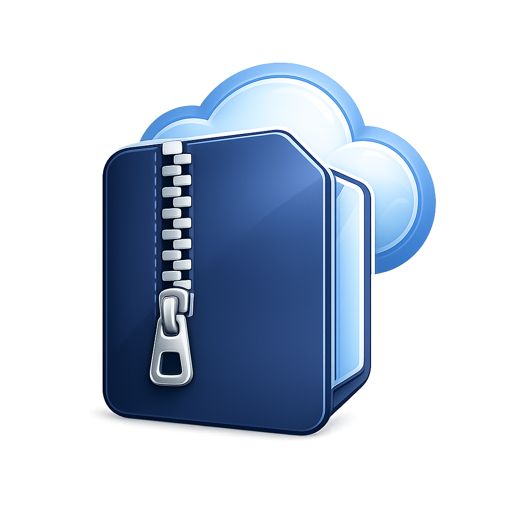
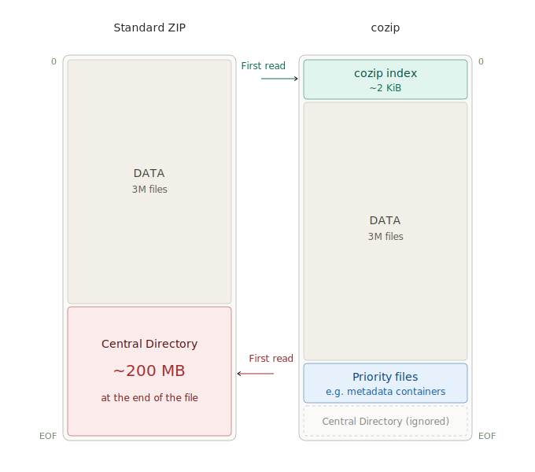

  

  # Cloud Optimized ZIP
  
  *Random access over HTTP. Open a ZIP like a table.*

  
  
  
  

---

  

## What is cozip

A cozip is a ZIP archive designed for direct access over the network.

It places a compact index at byte 0 with the offsets and sizes of selected files. A reader fetches that index in one request and jumps straight to the data it needs.

Everything else stays standard. Any ZIP tool can still open it.

In practice, cozip archives often include a `__metadata__` Parquet file that lists every entry with its name, offset, and size. Because it is just Parquet, tools like DuckDB, Arrow, or Polars can read it directly. This makes it possible to treat a cozip archive as a table and query its contents without scanning the whole file.

## License

MIT

   
  Developed with ❤️ by
    
  

